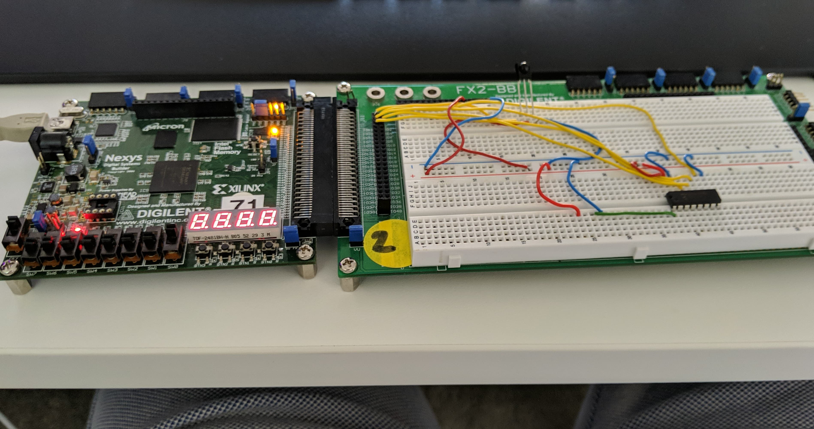

If you are about to choose a degree in the school of Computer Science and Engineering, this document is for you! So you know who I am, I’m a(bout to be a) third year Bachelor of Computer Science, which means I might be biased!

_Please note, this document is provided as is, and without any guarantee it’s correct. This is not an official piece of UNSW advice. I am not writing this on behalf of UNSW, or the School of Computer Science. This has not been reviewed by UNSW, and I make no promises this reflects the current state of UNSW’s rules. Please don’t sue me._

So first…, Some definitions:

**UNSW:** The University of New South Wales

**CSE:** The School of Computer Science and Engineering. Basically, they’re a part of the Faculty of Engineering, and they manage the courses that deal with computers.

**CS:** “Computer Science”

**SENG:** “Software Engineering”

**Comp Engg:** “Computer Engineering”

Wherever you see something like “COMP1511” or “ENGG1000”, I mean a course at the uni. You can generally google these to find what they teach, when they’re offered, and reviews of them. If you have questions about one, send me a msg :)

# So, I just finished the HSC, I don’t want to read, what course should I take?

With no further context, I would suggest doing Computer Science. 

… But

*   I've been told by my friends who do SENG that you should do SENG.
*   If you’re sure you want to do engineering, but not sure whether you want to do programming, doing flexible first year Engineering will let you try out CS/SENG without committing to it.
*   If you want to do a masters program overseas (or emmigrate), you may need to do a 4 year degree.
*   If you want to have the qualifications of an engineer (I’m yet to find a reason why you would want this, but I’m sure one exists), you probably need to do SENG.

So what are these courses?

# [Computer Science](https://www.handbook.unsw.edu.au/undergraduate/programs/2019/3778)

This is a really, really flexible degree that forces you to do the bare minimum of things you need to know to get a good job. It will hopefully teach you:

*   How to program (this is COMP1511)
*   How to answer interview questions in a coding job (this is COMP2521)
*   The really important parts of computer theory - comparing how good code is at doing things, and tradeoffs about why you would use one type of code over another (COMP2521/COMP3121)
*   How programming languages actually work (COMP1521)
*   How to write code as part of a team (COMP1531/COMP2511/COMP3900/COMP4900)
*   Some programming languages that are commonly used - C, Python and Java

You then get about 6 discipline electives, which you can choose to spend however you like. These let you specialise in something. For instance, if you enjoy COMP1521, you can learn more about how Operating Systems work. If you want to learn how to hack, you can take COMP6441\. Etc.

You also get 6 free electives, which you can either spend on doing courses within the entire uni (like arts or commerce), or on more comp electives.

One feature of the CS Degree is Majors, allowing you to specialize in a particular area of Computer Science (for instance, in Cyber Security, or AI). The consensus amongst most CS students is that majors aren't worth much in themselves, but it is nice to be recognised for your interests, if they align closely with a major.

This degree takes 3 years, but you can do a fourth honors year, where you write a thesis, if you want (subject to meeting the requirements, and completing subjects in time)

# [Software Engineering](https://www.handbook.unsw.edu.au/undergraduate/specialisations/2020/SENGAH)

I like to think of Software Engineering as Computer Science, but with sensible defaults. You get less choice about what you do, but all the courses will probably be useful and give you a broad understanding of how computers/programs work.

You get all of the things CS definitely teaches you, but now instead of getting lots of electives, you get told to do courses. Likely, you’d want to do some of these courses in a CS degree anyways, but SENG forces you to do them.

It also forces you to do some interesting “workshop” courses. I’ve been told by friends who do SENG that these courses are the best reason to want to do SENG over CS. I’ll pester them for more info about this and update this doc later.

You have to do a thesis in SEng.

# What is Computer Engineering?

The following section was written by a computer engineer (thank you Khye), because I know nothing about it.

I chose to be a Computer Engineer because I didn't want to only focus on the software side of tech. I always had a keen interest in IoT related things so I figured Computer Engineering was for me since it was a mix of hardware and software. For the most part, this is quite true. The best way to describe Computer Engineering is that it is essentially Electrical Engineering + Computer Science with a heavier focus on the Computer side.

For the Electrical Engineering side, you would have to do a lot of the Elec core courses including Math 2A,2B and Phys1A,1B along with a handful of Electrical courses. Overall, if you have a small interest in ElecEng, this might be interesting for you.

For the Computer side, in addition to the core CompSci courses that you would have to do, there's a bunch of hardware courses that are core to your degree as well, this largely has to do with FPGA programming and some assembly programming. FPGA programming makes up a bulk of these courses and could be a deal breaker for you. Unlike the wildly more popular software programming, FPGA programming works at a hardware level where you are literally programming logic gates to build components like registers and multiplexers. At a hardware level, most of the concepts of software programming goes out of the window, especially synchronous programming. If this sounds interesting to you, this degree could be for you.

Besides these courses, you'll also be able to choose from a bunch of comp electives that other CompSci can choose from as well, so don't think you'll be missing out on these! Furthermore, all engineers need to do a Thesis in the final year (not limited by hardware only if that matters to you) and also fulfill 60 days Industrial Training.

Moving on from course information, being a Computer Engineer also usually means small classes and a small cohort, there's not very many of us out there. To put things in numbers, the course that I'm doing right now which is a ComputerEng core, COMP3601 Design Project A, only has 41 enrolments. However, don't let that scare you because you'll also be doing a majority of your courses with CompSci, SEng and ElecEng peeps too.

In terms of lecturers, I personally haven't had a great experience with any of the lecturers from any of my CompEng courses (and I'm at the end of my 3rd year as of writing this), but you might hear the same from other CompSci/SEng students.

Overall, is Computer Engineering for you? If you have a keen interest in both hardware & software, and you're interested in learning about how computers work at an extremely low level, I would say yes, this is the degree for you. Otherwise, if software is more your thing, CompSci/SEng is probably the better choice.

# More Info

Here’s a comparison table (reminder, you should check this is all true, this isn't official advice, PLS don't sue me)

<table>

<tbody>

<tr>

<td> </td>

<td>

Computer Science

</td>

<td>

Software Engineering

</td>

</tr>

<tr>

<td>

Length

</td>

<td>

3 years, but with an optional 4th Honors year where you can do a thesis, if you want. This means that if you’ve got a juicy job offer, you can leave after 3 years and still have a degree.

</td>

<td>

4 years, with a thesis.

</td>

</tr>

<tr>

<td>

What computing courses do I have to take?

</td>

<td colspan="2">

Both CS and SENG do the same core computing courses. You will hopefully graduate knowing at least how to program in C, python, MIPS and Java. You’ll have knowledge of the sort of questions that pretty much every programming job asks you in an interview.

</td>

</tr>

<tr>

<td>

What’s different about manditory computing courses?

</td>

<td>

In Computer Science, a lot of your degree is electives - this means you can choose a lot of what you want to do. If you really enjoy a particular course, chances are it has an advanced version or a follow on, and the more electives you have, the more chance you’ll be able to do those courses.

</td>

<td>

SENG requires a lot more courses. They’re mostly courses you “should” take anyways, since they teach important concepts, but it’s less flexible about which courses you do. So it’s good if you don’t know what you should study (but realistically, if you were doing CS you could just copy most of the SENG courses and cover everything they do).

</td>

</tr>

<tr>

<td>

What math do I have to do?

</td>

<td>

CS requires first year math, as well as discrete math (which is very useful in computing, it talks a lot about probability, set theory and modular arithmetic - cool stuff that comes in handy when programming).

</td>

<td>

SENG requires everything CS does, but also requires a bit more maths.

</td>

</tr>

<tr>

<td>

What other stuff do I have to do?

</td>

<td>

You get lots of discipline electives, as well as 6 courses you can effectively use on anything.

</td>

<td>

You also have to do ENGG1000, which is a course about engineering teamwork. Some people enjoy it, but my reading of it is that a first year course with teamwork involved is going to be *very* risky (like, it could be good if you get a good team, or it could be really not fun if you’re doing all the work on a project you don’t like.

You then have to do 3 SENG workshops, which are apparently pretty good, and I’m told they are the best reason to choose SENG over COMP. I’m not convinced, and if you’re interested I can show you some COMP courses that compare to the SENG ones, but they might be a reason to do SENG. They basically teach principles of software design, as well as just “how to make something useful, in a team”

</td>

</tr>

<tr>

<td>

Will I get a job?

</td>

<td colspan="2">

Almost certainly, yes. Companies (as far as I know) don’t really have a major preference between SENG and Comp Sci. If you put in some effort and learn to program well, you’ll be desirable at any number of big companies and cool start-ups. And you’ll (maybe) make lots of money...

</td>

</tr>

</tbody>

</table>

If you’ve got questions, shoot me a message and I’ll update this.